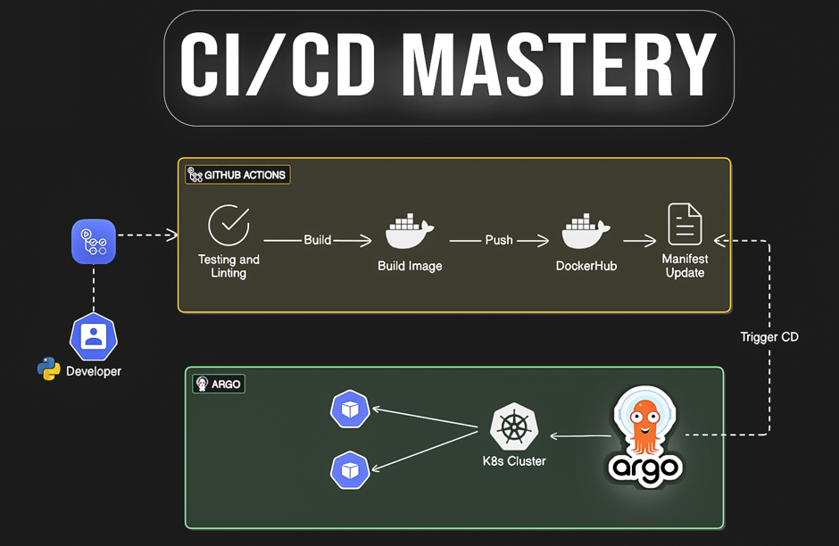
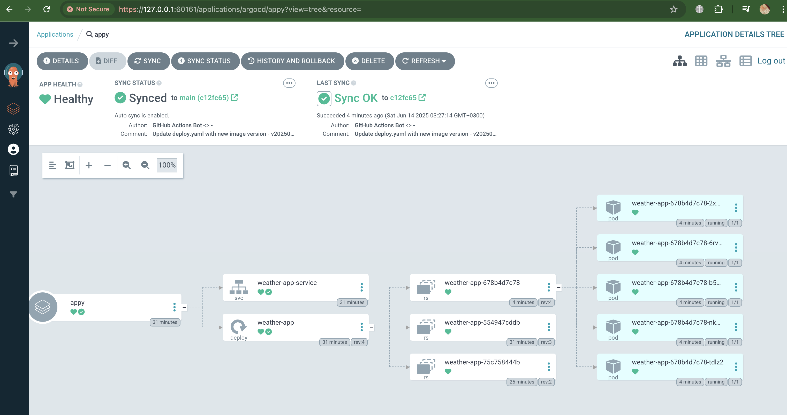
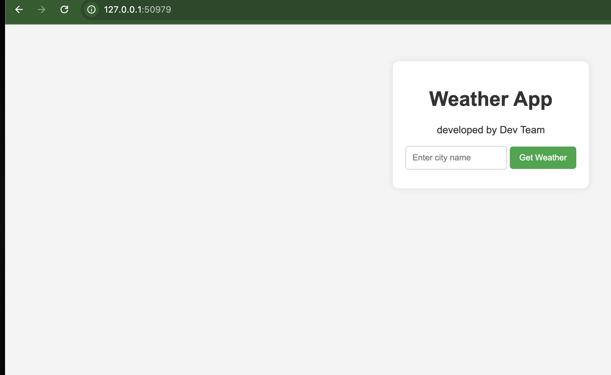
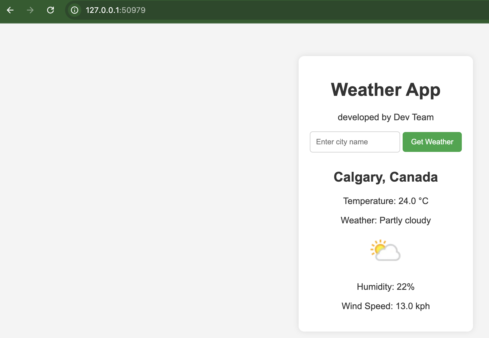
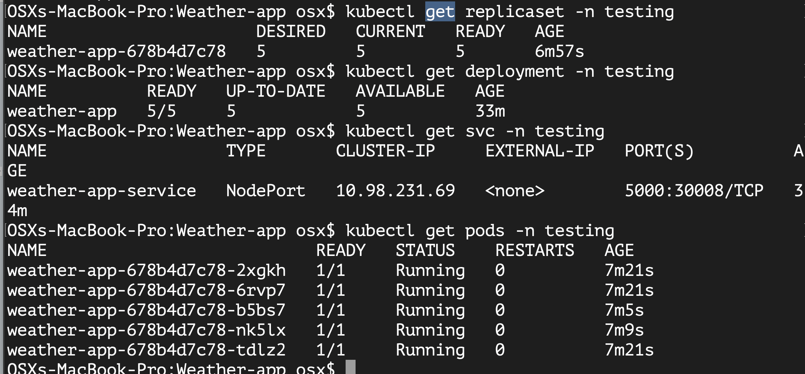

# Weather-app
Deploying Flask weather app using githubs action and argo cd following gitops approach

Appication Architecture

---------------------------------------------------------------------------
Workflow

Developer will add feature or make changes on code then push changes to main branch so CI Pipeline will be triggered through github actions that will runs on github runner of os ubuntu that will do the following

a) Check out code on ubuntu runner
b) Install python
c) Install Docker
d) Install Dependcies
e) Install Docker
f) Build docker image && push it to docker hub
e) Update Manifest file with new tagged image 
f) Push updated yaml file to github repository from github runner

After manifest file on Github repository updated this will role of argocd to pull new updates and applied to k8s cluster

## Argocd Application

## Weather APP

## Fetch data from API

## Deployed resources to cluster

